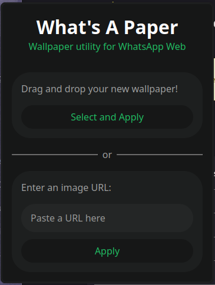

# What's A Paper

A wallpaper setter extension for Chromium and Firefox browsers.

> [!WARNING]  
> This would be a Work in Progress if I was actually working and
> making progress.  
> Just know that it is incomplete lol. If you want to check out the
> extension you might want to check out the "Usage" section to see
> how bad it is before you install it.

## Installation

1. [Download the code as a ZIP](https://github.com/A31Nesta/WhatsAPaper/archive/refs/heads/main.zip)
    - If you don't want to click on sussy links, click on the green "Code" button and then on "Download ZIP".
2. On **Firefox**:
    - Go to **Extensions and Themes** inside the top-right settings menu (top-left `...` menu on Zen)
    - Click on the gear icon next to "**Manage Your Extensions**"
    - Click on "**Install Add-on From File...**"
    - Select the **ZIP File** you just downloaded. 
3. On **Chromium**:
    - **Extract** the contents of the ZIP file you just downloaded.
    - Under the top-right settings menu, click on "**Extensions**" and then on "**Manage Extensions**"
    - Enable "Developer mode" with the top-right toggle.
        - This enables you to use extensions that are not in the web store
    - You should see three new buttons appear, click on "**Load Unpacked**"
    - Select the `manifest.json` file.

## Usage

If you click on this extension's icon (a default from your browser, it
can be a puzzle piece on Firefox or a square with a "W" on Chrome), you'll
see this interface:

### Local Images

> [!WARNING]  
> The following information is 100% false, this option doesn't work at all.  
> (I know why but basically there's no fix and I should restructure the
> extension a bit so that it's configured without using the pop-up thingy)

This option allows you to set a local image from your computer as a wallpaper
in WhatsApp. Simply drag and drop the image or click on "Select and Apply"
and select the image to apply it as a wallpaper.

The wallpaper will be updated instantly without needing to reload.

> [!NOTE]  
> **The images you select as Wallpapers are not uploaded anywhere!** They're
> stored in your browser and will not be synced between devices or stored
> in any cloud forever so I can sell your private photos and get rich.
>
> If you know a bit of programming you can verify this by checking out the
> `save` function inside `browserAction/util.js`. It's used in
> `setWallpaper.js` for both URLs and local images.

### URLs

> [!WARNING]  
> **This kinda works!**  
> The UI might lag and become unusable on Chromium when writing in the text
> box, I don't know why because I mainly use Firefox and it doesn't lag
> there. **BUT**, this won't happen once I make the new config interface
> that supports uploading local files.
>
> The only completely false thing below is that you *DO* need to reload
> the page after you set a wallpaper.

This option allows you to set *ANY* image on the internet as a wallpaper.
Just paste the URL in the text box and click on "Apply".

If you have WhatsApp Web open, you'll see the background instantly change
without requiring a reload.